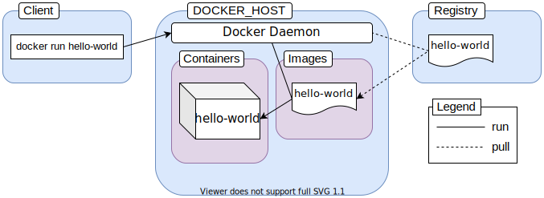
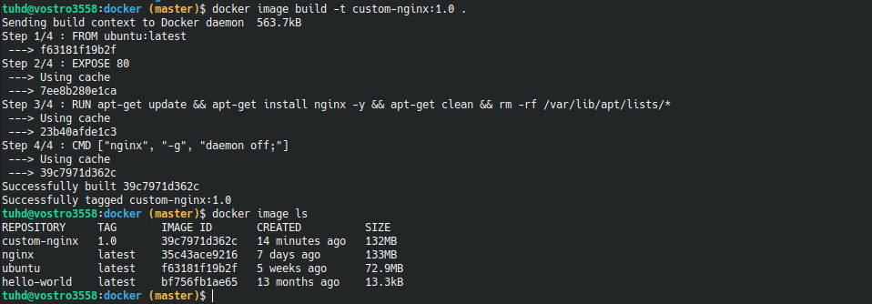

# Docker basic
[Source](https://www.freecodecamp.org/news/the-docker-handbook)

## Container

__Virtual Machine__
* 
* Each virtual machine comes with its own guest operating system
* Application running inside a virtual machine communicates with the guest operating system
* Guest operating system talks to the hypervisor
* Hypervisor talks to the host operating system to allocate necessary resources from the physical infrastructure to the running application.

__Docker__
* 
* The container runtime, that is Docker, sits between the containers and the host operating system instead of a hypervisor
* The containers then communicate with the container runtime which then communicates with the host operating system to get necessary resources from the physical infrastructure.

> A container is an abstraction at the application layer that packages code and dependencies together. Instead of virtualizing the entire physical machine, containers virtualize the host operating system only.

> __Containers to be the next generation of virtual machines.__

## Image

> Images are multi-layered self-contained files that act as the template for creating containers. They are like a frozen, read-only copy of a container. Images can be exchanged through registries.

> Containers are just images in running state. When you obtain an image from the internet and run a container using that image, you essentially create another temporary writable layer on top of the previous read-only ones.

## Registry

> An image registry is a centralized place where you can upload your images and can also download images created by others.

[Docker Hub](https://hub.docker.com/) is the default public registry for Docker. 

> There is also a local registry that runs within your computer that caches images pulled from remote registries.

## Docker Architecture

> _Docker uses a client-server architecture. The Docker client talks to the Docker daemon, which does the heavy lifting of building, running, and distributing your Docker containers_

__The engine consists of three major components:__
1. __Docker Daemon__: The daemon (dockerd) is a process that keeps running in the background and waits for commands from the client. The daemon is capable of managing various Docker objects.
2. __Docker Client__: The client  (docker) is a command-line interface program mostly responsible for transporting commands issued by users.
3. __REST API__: The REST API acts as a bridge between the daemon and the client. Any command issued using the client passes through the API to finally reach the daemon.

__When you execute `docker run hello-work`__

* Docker client reaches out to the daemon, tells it to get the hello-world image and run a container from that.
* Docker daemon looks for the image within your local repository and realizes that it's not there, resulting in the Unable to find image 'hello-world:latest' locally that's printed on your terminal.
* The daemon then reaches out to the default public registry which is Docker Hub and pulls in the latest copy of the hello-world image, indicated by the latest: Pulling from library/hello-world line in your terminal.
* Docker daemon then creates a new container from the freshly pulled image.
* Finally Docker daemon runs the container created using the hello-world image outputting the wall of text on your terminal.

## Container manipulation

### Run a container
> `docker run <image name>`

This is a perfectly valid command, but there is a better way of dispatching commands to the docker daemon : 
> `docker <object> <command> <options>`

With:
* `object` indicates the type of Docker object you'll be manipulating. This can be a `container`, `image`, `network` or `volume` object.
* `command` indicates the task to be carried out by the daemon, that is the `run` command.
* `options` can be any valid parameter that can override the default behavior of the command, like the `--publish` option for port mapping.

The `run` command can be written :
> `docker container run <image name>`

Exam :
> `docker container run --publish 8080:80 fhsinchy/hello-dock`

### Publish a port
Containers are isolated environments. Your host system doesn't know anything about what's going on inside a container. Hence, applications running inside a container remain inaccessible from the outside.

To allow access from outside of a container, you must publish the appropriate port inside the container to a port on your local network. The common syntax for the --publish or -p option is as follows:
> `--publist <host port>:<container port>`

### Detached mode
In order for the container to keep running, you had to keep the terminal window open. Closing the terminal window also stopped the running container.

In order to override this behavior and keep a container running in background, you can include the --detach option.

Exam:
> `docker container run --detach --publish 8080:80 fhsinchy/hello-dock`

> Note: The order of the options you provide doesn't really matter. If you put the --publish option before the --detach option, it'll work just the same. But the image name must come at last. 

### List container
* `docker container ls` :  list out containers that are currently running.
* `docker container ls --all` or `docker container ls -a` : list out the containers that have run in the past

### Name and rename container
By default, every container has two identifiers :
* __CONTAINER ID__ - a random 64 character-long string.
* __NAME__ - combination of two random words, joined with an underscore.
* 

Naming a container can be achieved using the `--name` option.

Exam:
> ~docker container run -d -p 8080:80 --name hello-dock fhsinchy/hello-dock

To rename old containers using the container rename command.
> `docker container rename <container identify> <new name>`

### Stop container 
* `docker container stop <container identifier>`
* `docker container kill <container identifier>`

### Restart container 
Restarting a container that has been previously stopped or killed
> `docker container start <container identify>`

Rebooting a running container
> `docker container restart <container identify>`

### Create container without run
Use command `create` to create a container from given image

### Delete container
Use command `rm` to remove a container

You can use `--rm` option in `container run` or `container start` to make container removed when it stopped
 

### Run container in interactive mode
Images like ubuntu, fedora, python, node ,...  do not just run some pre-configured program. These are instead configured to run a shell by default.

An image configured to run such a program is an interactive image. These images require a special `-it` option to be passed in the container run command.

Without `-it` option, you'll see nothing happend: 

With `-it` opotion, you'll entry to the bash of container:

The `-it` option sets the stage for you to interact with any interactive program inside a container. This option is actually two separate options mashed together :
* The `-i` or `--interactive` option connects you to the input stream of the container, so that you can send inputs to bash.
* The `-t` or `--tty` option makes sure that you get some good formatting and a native terminal-like experience by allocating a pseudo-tty.

## Image manipulation

Image command can be use by :
> `docker image <command> <option>`

### List and remove image

Like container, you can use
> `docker image ls`
> `docker image rm <image identify>`
> `docker image prune --force` : to remove all un-tagged images

### Create a image

Dockerhub has a ton of pre-built images suitable for development, but you can create images your own.

A `Dockerfile` is a collection of instructions that, once processed by the daemon, results in an image. Exam : 

Images are multi-layered files and in this `Dockerfile` above, each line (known as instructions) that you've written creates a layer for your image.
* Every valid `Dockerfile` starts with a `FROM` instruction. This instruction sets the base image for your resultant image.
* The `EXPOSE` instruction is used to indicate the port that needs to be published.
* The `RUN` instruction in a Dockerfile executes a command inside the container shell.
* The `CMD` instruction sets the default command for your image. 

When you have a Dockerfile, you can build a image from it

To build image from Dockerfile above, open terminal in the directory of Dockerfile :
> `docker image build .`

Now you can run this image 
> `docker container run --rm -d -p 8080:80 --name custom-nginx 3199372aa3fc`

### Naming and tagging image

In above, you created an image but this image have no name and tag

You can naming and tagging an image when creating it by use `--tag` or `-t` option
> `docker image build -t <image name>:<image tag> .`

__NOTE__ : when you run a container but not specify the tag of image, docker will automatic run the `latest` tag

### Share image in Docker Hub

Login docker in terminal : 

To share image online , the image has to be tagged by : `<username>/<image name>:<image tag>`

Then you can push to dockerhub

In dockerhub: 

### Download image from Dockerhub

> `docker pull <imagename>`

Exam: `docker pull hadinhtu97/custom-nginx`

