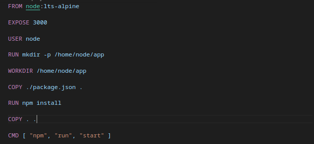
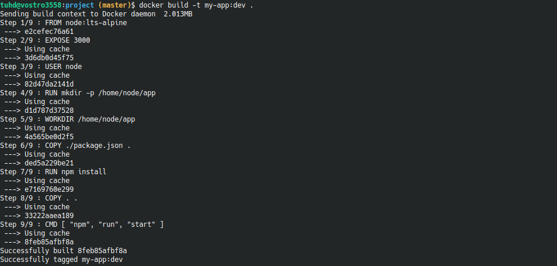
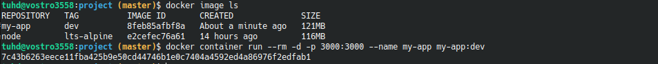
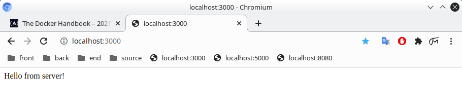
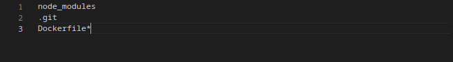

# How to containerize a js project

The `project` directory is an exam nodejs project, using express and send a hello message when entry to port.

Making plan of how application run :
* Get a good base image for `Node`
* App will run in port 3000
* Set the default working directory inside the image.
* Copy the `package.json` file into the image.
* Install necessary dependencies.
* Copy the rest of the project files.
* Start express when run `npm run start`

So, the `Dockerfile` in `project` should like:

Then, you can build :

And run :

Result :

## Bind Mounts

The problem is, when you change code in project, reload the browser, nothing change. Because you making change in you local file system, but your app is runnign inside the container file system

To solve this issue, you can again make use of a bind mount. Using bind mounts, you can easily mount one of your local file system directories inside a container.

Instead of making a copy of the local file system, the bind mount can reference the local file system directly from inside the container.

Bind mounts can be created using the `--volume` or `-v` option for the container `run` or container `start` commands. 
> `-v <local absolute path>:<container absolute path>`

Exam : `docker container run --rm -d -p 3000:3000 --name my-app -v $(pwd):/home/node/app myapp:latest`

## Ignore unnecessary file

Like `.gitignore`, docker has `.dockerignore` to ignore files and directories to be excuted when build image. Exam :

