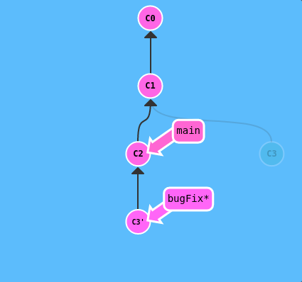

# Git commands basic

# Workflow
* 
* If you consider a file in your Working Directory, it can be in three possible states :
  * __It can be staged__. Which means the files with the updated changes are marked to be committed to the local repository but not yet committed.
  * __It can be modified__. Which means the files with the updated changes are not yet stored in the local repository.
  * __It can be committed__. Which means that the changes you made to your file are safely stored in the local repository.

## Setup git
* Install git :  `sudo apt install git`
* Check git version : `git --version`
* Config git : 
  * `git config --global user.name <YOUR_USERNAME>`
  * `git config --global user.email <YOUR_EMAIL>`

## Commit
* `git add` : stage change
  * `git add <file>`
  * `git add .`
* `git commit -m <subject>` : commit stage changed . previous commit is prrent of this commit
  * `git commit -m <subject> -m <description>`
  * 
* `git status` : check status
* `git diff` : view files changes not yet staged

## Branch
* `git branch` : view all branch
  * `git branch <name>` : create new branch
  * `git branch -d <name>` : delete a branch
  * `git checkout <name>` : move to branch name
  * `git checkout -b <name>` : create and move to new branch

## Combine branch
* `git merge <branchName>` : merge a branch into current branch. In practive, we work in a develop branch, then go back to main branch, then merge main branch with develop branch. Merge with create a new commit has two parent, first is a previous commit in main branch, second is a previous commit in develop branch
  * 
  * `git merge bugFix`
  * 
* `git rebase <branchName>` : rebase a branch into current branch.
  * 
  * `git rebase main`
  * 
* `git cherry-pick <commit1> <commit2> ...` : move commits into current branch
  * 
  * `git cherry-pick C2 C4`
  * 

## Move
* HEAD: is the symbolic name for the currently checked out commit -- it's essentially what commit you're working on top of. HEAD always points to the most recent commit which is reflected in the working tree. Most git commands which make changes to the working tree will start by changing HEAD. Normally HEAD points to a branch name (like bugFix). When you commit, the status of bugFix is altered and this change is visible through HEAD.
  * 
  * `git checkout C1`
  * 
* Relative refs: `^` : moving upwards one commit or `~number` : moving upwards number commit
  * 
  * `git checkout main^`
  * 

## Reverse
* `git reset` : reverts changes by moving a branch reference backwards in time to an older commit. In this sense you can think of it as "rewriting history;". git reset will move a branch backwards as if the commit had never been made in the first place.
  * 
  * `git reset HEAD^`
  * 
* `git revert` : resetting works great for local branches on your own machine, its method of "rewriting history" doesn't work for remote branches that others are using. In order to reverse changes and share those reversed changes with others, we need to use git revert. Let's see it in action.
  * 
  * `git revert HEAD`
  * 
  * new commit C2' introduces changes -- it just happens to introduce changes that exactly reverses the commit of C2.

## Remote
* `git remote add origin <REMOTE_REPO_URL>` : set new remote
  * `git remote -v` : List the remote connections you have to other repositories.
* `git push <REMOTE_NAME> <BRANCH>` : push change in local repo to remote repo
* `git clone <REMOTE_REPO_URL>` : clone a remote repo